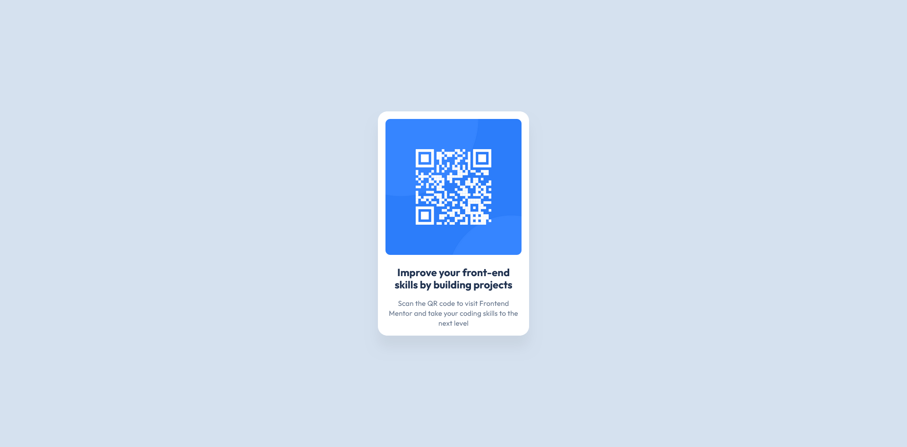

# Frontend Mentor - QR code component solution

This is a solution to the [QR code component challenge on Frontend Mentor](https://www.frontendmentor.io/challenges/qr-code-component-iux_sIO_H). Frontend Mentor challenges help you improve your coding skills by building realistic projects. 

## Table of contents

- [Overview](#overview)
  - [Screenshot](#screenshot)
  - [Links](#links)
- [My process](#my-process)
  - [Built with](#built-with)
  - [What I learned](#what-i-learned)
  - [Continued development](#continued-development)
- [Author](#author)

## Overview

### Screenshot

### Links

- Solution: [GitHub Repository](https://github.com/Kking927/Frontend-Mentor-QR-Code-Component)
- Live Site: [Live Site](https://kking927.github.io/Frontend-Mentor-QR-Code-Component/)

## My process

### Built with

- Semantic HTML5 markup
- CSS custom properties
- Flexbox
- Mobile-first workflow

### What I learned

I improved my ability to implement a fluid layout without relying on media queries. By using max-width and percentage-based widths, I created a component that naturally adapts to different screen sizes.

### Continued development

In future projects, I plan to focus on:

- **Fluid Design:** Mastering responsive layouts that work across all device sizes without complex code.
- **Accessibility:** Learning to use proper HTML structure and descriptive alt text so my websites are usable for everyone.

## Author

- Frontend Mentor - [Kking927](https://www.frontendmentor.io/profile/Kking927)
